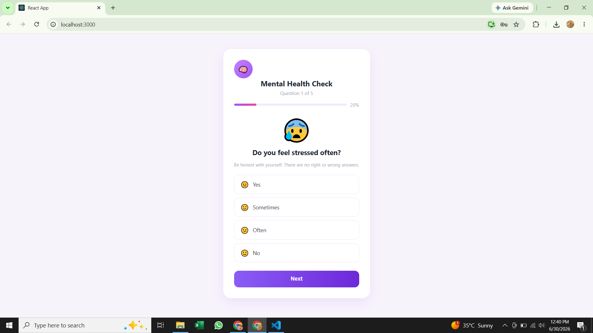
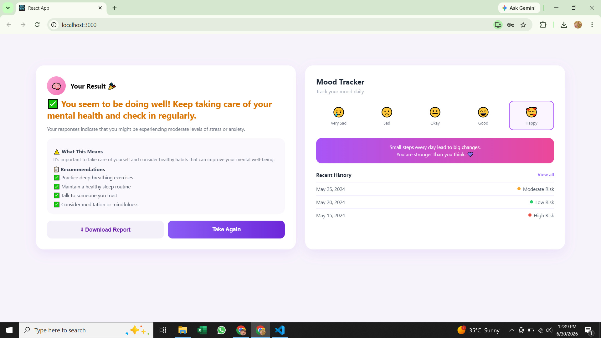

# 🧠 Mental Health Predictor

A Machine Learning-based web application that predicts a user's mental health condition based on questionnaire responses. The project combines a React frontend, a Node.js backend, and a Python machine learning model to provide accurate and user-friendly mental health predictions.

---

## 📖 Overview

Mental Health Predictor is designed to help users assess their mental health by answering a set of questions. The responses are processed by a trained Machine Learning model, and the prediction is displayed through an easy-to-use web interface.

This project demonstrates the integration of **Machine Learning**, **Python**, **Node.js**, and **React.js** into a complete full-stack web application.

---

## ✨ Features

- 📝 Mental health assessment through a questionnaire
- 🤖 Machine Learning-based prediction
- 🌐 Responsive React frontend
- ⚡ REST API using Node.js and Express
- 🐍 Python prediction model
- 📊 Trained Scikit-learn model
- 💻 Simple and user-friendly interface

---

## 🛠 Technologies Used

### Frontend
- React.js
- HTML5
- CSS3
- JavaScript

### Backend
- Node.js
- Express.js

### Machine Learning
- Python
- Scikit-learn
- Pandas
- NumPy

### Dataset
- Mental Health Survey Dataset

---

## 📁 Project Structure

```text
Mental-health-predictor
│
├── client/
│   ├── public/
│   ├── src/
│   ├── package.json
│   └── package-lock.json
│
├── mental.ipynb
├── mental_health_model.pkl
├── predict.py
├── server.js
├── package.json
├── package-lock.json
├── survey.csv
└── README.md
```

---

## ⚙️ Installation

### 1. Clone the repository

```bash
git clone https://github.com/Zahra-78-ba/Mental-health-predictor.git
```

### 2. Open the project

```bash
cd Mental-health-predictor
```

### 3. Install backend dependencies

```bash
npm install
```

### 4. Install frontend dependencies

```bash
cd client
npm install
```

### 5. Return to the project root

```bash
cd ..
```

### 6. Start the backend server

```bash
node server.js
```

### 7. Start the React frontend

Open another terminal and run:

```bash
cd client
npm start
```

The application will open in your browser.

---

## 🚀 How It Works

1. User opens the web application.
2. User fills out the mental health questionnaire.
3. The React frontend sends the responses to the Node.js backend.
4. The backend calls the Python prediction script.
5. The Machine Learning model predicts the mental health status.
6. The prediction result is displayed to the user.

---

## 📊 Machine Learning Model

The project uses a trained **Scikit-learn** model saved as:

```
mental_health_model.pkl
```

The prediction logic is implemented in:

```
predict.py
```

---

## 📂 Dataset

The model was trained using the dataset:

```
survey.csv
```

---

## 🔮 Future Improvements

- Improve prediction accuracy
- Add user authentication
- Store prediction history
- Visualize prediction reports
- Deploy the application to the cloud
- Integrate an AI mental health chatbot

---

## 📸 Screenshots

### 🏠 Home Page

.png)


### 📝 Questionnaire



### 📊 Prediction Result




## 👩‍💻 Author

**Zahra Batool**


